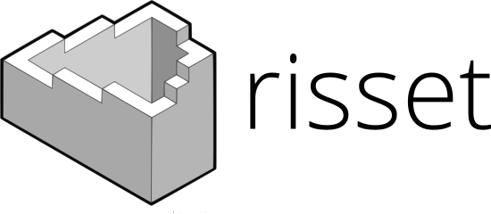

# Csound Plugins Documentation

This repository holds the documentation of csound plugins defined within [risset], 
the csound package manager.

This repository holds a build of the html documentation produced by risset via mkdocs. The 
original documentation is defined and hosted by each plugin. *risset* gathers the manual
pages for each opcode and produces a manual and index for all external plugins defined in 
its index.

The html documentation can be consulted here: XXX

![](assets/risset-manual.jpg]

[risset]: https://github.com/csound-plugins/risset
